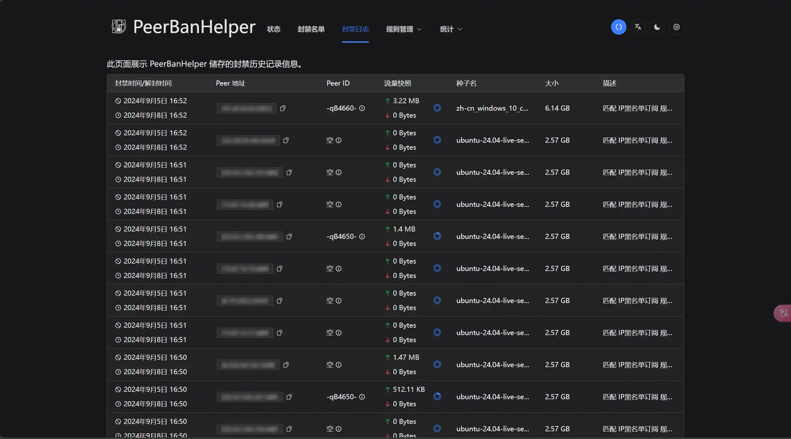

+++
date = '2024-09-05T18:00:00+08:00'
draft = false
title = '简单的 BT 反吸血措施'
categories = ['Resource']
+++

## 什么是 BT 吸血？

是指某些占用公众的 BT 上传带宽给自我进行下载而不自我进行上传的行为，这种行为严重影响到 BT 环境。本文介绍 2 个简单的 BT 反吸血措施。

## 使用 qBittorrent Enhanced Edition

这是一个基于 qBittorrent 的开发的增强版本，不仅有可以定期从 [TrackersListCollection](https://trackerslist.com/#/zh) 等 Tracker 服务器资源平台获取不同种类服务器列表的功能，还可以简单地封禁一些常见的吸血客户端。

[仓库下载地址](https://github.com/c0re100/qBittorrent-Enhanced-Edition/releases)

## 使用 PeerBanHelper

这是一个可以自动检测当前 BT 下载客户端内连接用户列表并识别、封禁不正常的客户端的工具。并其还可以支持自定义规则。

仓库介绍功能包括：PeerId黑名单/UserAgent黑名单/IP CIDR/假进度/超量下载/进度回退/多播追猎/连锁封禁/伪装检测 支持qBittorrent/Deluge/BiglyBT/Vuze(Azureus)

推荐与 qBittorrent 一同搭配使用

[仓库下载地址](https://github.com/PBH-BTN/PeerBanHelper/releases)

