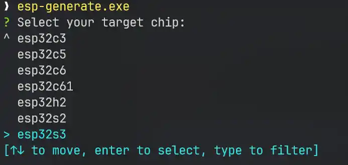
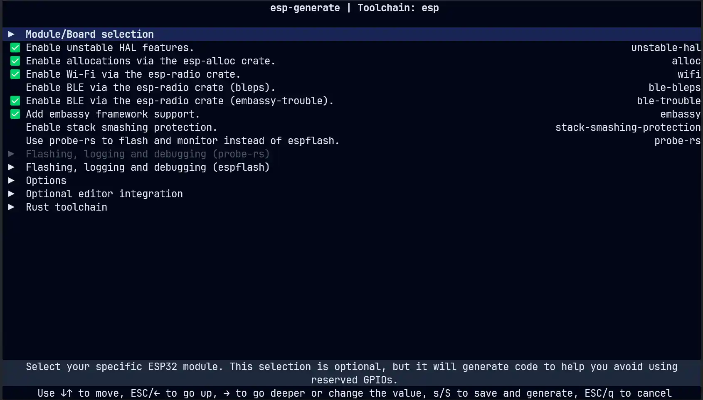

+++
date = '2025-05-11T12:00:00+08:00'
draft = false
title = '使用 Rust 进行 ESP32 开发'
categories = ['Develop']
tags = ['Notes', 'Rust', 'ESP32']
+++

## 相关资源

[ESP32 Rust 开发指南](https://docs.espressif.com/projects/rust/book/preface.html)
[ESP32 std 开发指南](https://narukara.github.io/std-training-zh-cn/)
[ESP32 no-std 开发指南](https://docs.espressif.com/projects/rust/no_std-training/01_intro.html)

## 介绍

Rust 作为一门现代化的编程语言非常适合进行嵌入式系统开发。本文基于 embassy 嵌入式生态在 esp32s3 上进行 no_std hal 库开发，这也是 esp32 官方文档中推荐的一种开发方式。

## 环境准备

首先我们需要了解 esp32 的硬件内容，esp32s3 是基于 Xtensa 架构的 32 位 LX7 双核处理器，时钟频率最高能达 240 MHz。我手上的是 N16R8 型号的，也就是有 16MB 的 flash 存储以及 8MB 的 PSRAM。支持 Wi-Fi 802.11 b/g/n 以及 5.0 低功耗蓝牙。硬件方面比较丰富，甚至可以端侧跑小体量的模型，让我们来折腾下 Rust 开发也是绰绰有余。

工具链安装

```bash
cargo install espup --locked
espup install
```

安装 esp-generate 项目模板生成工具，espflash 刷写调试工具就能开始基础开发了。

```bash
cargo install esp-generate --locked
cargo install espflash --locked
```

终端在空目录打开，输入 esp-generate 开始项目配置。软件会要求你选择芯片型号，这里我选择 esp32s3。



然后输入项目名称。下面选择模板配置。



第一项选择芯片具体型号。使用 unstable hal 库，这样才能用 WiFi 和蓝牙功能。蓝牙这里可以选择使用 [ble-bleps](https://github.com/bjoernQ/bleps) 或者 [ble-trouble](https://github.com/embassy-rs/trouble)。这边推荐 embassy 生态的 ble-trouble，维护更加积极，并且支持异步特性。~~毕竟 ble-bleps 说自己是一个 toy-level BLE peripheral stack~~。

下面是 Wokwi 模拟，GitHub 工作流，编辑器相关配置集成等内容，按自己需求选择。最重要的是要选中使用 esp 的工具链，不然没有我们想要的 `xtensa-esp32s3-none-elf` 编译目标。

一切配置完毕，按下 `s` 键生成代码模板。

## 访问下互联网

一个有 WiFi 功能的单片机很是让人想迫不及待使用下其 WiFi 功能，~~虽然单片机一般从点灯大师开始~~。

在[官方教程](https://docs.espressif.com/projects/rust/no_std-training/03_6_http_client.html)中使用了 (reqwless)[https://crates.io/crates/reqwless] 库进行 HTTP 通讯。在写博客时这个库编译有问题，查看 Issue 发现是太久没更新 TLS 依赖导致的，转头在社区中找到一个新兴的 [nanofish](https://crates.io/crates/nanofish) 库来代替使用。

### 改动下 Cargo.toml

`embassy-net` 是 `smoltcp` 的高级封装，我们不用引用 `smoltcp`，直接移除无影响。

`embassy-net` 启用 `proto-ipv4` 和 `dns` 特性。

加入 `nanofish` 依赖和通过串口打印输出的 `esp-println`

```bash
cargo add nanofish --features tls
cargo add esp-println --features esp32s3
```

注释掉 `profile.release` 中的 `debug = 2`

### WiFi 连接

可以看到已经生成 WiFi 初始化的代码，但是还不够。这只是初始化了 WiFi 的硬件控制，具体控制需要交给 embassy_net 完成。

```rust
let (mut _wifi_controller, _interfaces) =
        esp_radio::wifi::new(peripherals.WIFI, Default::default())
            .expect("Failed to initialize Wi-Fi controller");
```

embassy_net 初始化大概是下面这个样子。

```rust
let (mut wifi_controller, wifi_inter) =
    esp_radio::wifi::new(peripherals.WIFI, Default::default())
        .expect("Failed to initialize Wi-Fi controller");

// 需要的资源
let wifi_cfg = embassy_net::Config::dhcpv4(DhcpConfig::default());
let wifi_res: &mut StackResources<4> = Box::leak(Box::new(StackResources::new())); // 需要 'static 生命周期，这里用 alloc 的 Box::leak 让其 'static

// 随机数
let rng = Rng::new();
let mut u64_rand = [0u8; 8];
rng.read(&mut u64_rand);
let rand_seed = u64::from_le_bytes(u64_rand);

// 得到 stack 和 runner
let (wifi_stack, wifi_runner) =
    embassy_net::new(wifi_inter.station, wifi_cfg, wifi_res, rand_seed); // station 模式驱动
```

然后设置要连接的接入点。

```rust
let wifi_conn_cfg = wifi::Config::Station(
        wifi::sta::StationConfig::default()
            .with_ssid("Your wifi ssid")
            .with_password("Your wifi password".into()),
    );
wifi_controller
    .set_config(&wifi_conn_cfg)
    .expect("Failed to set wifi cfg");
```

但是这样还不能运行，还需要创建一个任务来维持我们的 WiFi 协议栈运行。

```rust
#[embassy_executor::task]
async fn wifi_runner_task(mut runner: Runner<'static, Interface<'static>>) {
    runner.run().await;
}

#[embassy_executor::task]
async fn wifi_conn_task(mut ctrl: WifiController<'static>) {
    loop {
        match ctrl.connect_async().await {
            Ok(conn) => {
                println!("Connected to AP: {:?}", conn);
                let dis_conn = ctrl.wait_for_disconnect_async().await.ok();
                println!("Disconnect: {:?}", dis_conn);
            }
            Err(err) => {
                println!("WiFi error: {:?}", err);
            }
        }
    }
}
```

在设置接入点信息(也就是 `set_config`)后加入下面两行，让 embassy 执行 WiFi 控制器以及 WiFi 协议栈的异步任务

```rust
spawner.spawn(wifi_conn_task(wifi_controller).unwrap());
spawner.spawn(wifi_runner_task(wifi_runner).unwrap());
```

不出意外，编译烧录就能正常连上 WiFi 了。

当然，还需要等一下 DHCP 获取下 IP 地址才能和互联网通讯。

```rust
wifi_stack.wait_link_up().await;
wifi_stack.wait_config_up().await;
println!("Got IPv4: {:?}", wifi_stack.config_v4());
```

### HTTP 一下

这里用 `nanofish` 就很简单。`reqwless` 使用方法也类似，具体可[查看文档](https://docs.rs/reqwless/latest/reqwless/)。

```rust
let client = nanofish::DefaultHttpClient::new(&wifi_stack); // 如果这里报错了，说明版本对不上，需要更新下
let mut rx_buf = [0u8; 2048];
let headers = [nanofish::HttpHeader::user_agent("esp32s3/test")];
match client
    .get(
        "https://www.cloudflare.com/cdn-cgi/trace",
        &headers,
        &mut rx_buf,
    )
    .await
{
    Ok((resp, resp_size)) => {
        println!("Http status: {:?}", resp.status_code);
        println!("Http body: {:?}", resp.body.as_str());
    }
    Err(err) => {
        println!("Http error: {:?}", err);
    }
}
```

## 完整代码

```rust
#[esp_rtos::main]
async fn main(spawner: Spawner) -> ! {
    // 此处省略一堆生成的代码...

    let (mut wifi_controller, wifi_inter) =
        esp_radio::wifi::new(peripherals.WIFI, Default::default())
            .expect("Failed to initialize Wi-Fi controller");

    // 需要的资源
    let wifi_cfg = embassy_net::Config::dhcpv4(DhcpConfig::default());
    let wifi_res: &mut StackResources<4> = Box::leak(Box::new(StackResources::new()));

    // 随机数
    let rng = Rng::new();
    let mut u64_rand = [0u8; 8];
    rng.read(&mut u64_rand);
    let rand_seed = u64::from_le_bytes(u64_rand);

    // 得到 stack 和 runner
    let (wifi_stack, wifi_runner) =
        embassy_net::new(wifi_inter.station, wifi_cfg, wifi_res, rand_seed);

    let wifi_conn_cfg = wifi::Config::Station(
        wifi::sta::StationConfig::default()
            .with_ssid("Your wifi ssid")
            .with_password("Your wifi password".into()),
    );
    wifi_controller
        .set_config(&wifi_conn_cfg)
        .expect("Failed to set wifi cfg");

    spawner.spawn(wifi_conn_task(wifi_controller).unwrap());
    spawner.spawn(wifi_runner_task(wifi_runner).unwrap());

    wifi_stack.wait_link_up().await;
    wifi_stack.wait_config_up().await;
    println!("Got IPv4: {:?}", wifi_stack.config_v4());

    let client = nanofish::DefaultHttpClient::new(&wifi_stack); // 如果这里报错了，说明版本对不上，需要更新下
    let mut rx_buf = [0u8; 2048];
    let headers = [nanofish::HttpHeader::user_agent("esp32s3/test")];
    match client
        .get(
            "https://www.cloudflare.com/cdn-cgi/trace",
            &headers,
            &mut rx_buf,
        )
        .await
    {
        Ok((resp, resp_size)) => {
            println!("Http status: {:?}", resp.status_code);
            println!("Http body: {:?}", resp.body.as_str());
        }
        Err(err) => {
            println!("Http error: {:?}", err);
        }
    }

    loop {
        Timer::after(Duration::from_secs(1)).await;
    }
}

#[embassy_executor::task]
async fn wifi_runner_task(mut runner: Runner<'static, Interface<'static>>) {
    runner.run().await;
}

#[embassy_executor::task]
async fn wifi_conn_task(mut ctrl: WifiController<'static>) {
    loop {
        match ctrl.connect_async().await {
            Ok(conn) => {
                println!("Connected to AP: {:?}", conn);
                let dis_conn = ctrl.wait_for_disconnect_async().await.ok();
                println!("Disconnect: {:?}", dis_conn);
            }
            Err(err) => {
                println!("WiFi error: {:?}", err);
            }
        }
    }
}
```
