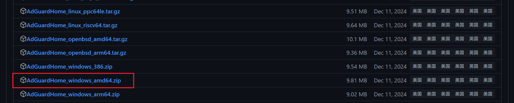

+++
date = '2025-01-13T18:00:00+08:00'
draft = false
title = '使用 Adguard Home 减少广告'
categories = ['Depoly']
+++

AdGuard Home 是 Adguard Software 下的一款可以自主搭建的私人 DNS 服务器服务端，有很多强大的拦截规则（大多数是社区提供的），可以拦截广告、不良网站等内容。

> 这种拦截是在 DNS 解析层面进行的，因此软件/网站可能会使用其它技术或手段绕过了 DNS 拦截。

[官方文档](https://github.com/AdguardTeam/AdGuardHome/wiki/Getting-Started)

## 懒人用法

到 AdGuard 的官方网站中使用其提供的 AdGuard DNS 服务，这个服务使用效果和自己搭建 AdGuard Home 的效果是一样的，每月有 30 万次的 DNS 免费查询拦截额度，超过 30 万次后就和普通的 DNS 一样工作了。实测下来 30 万次有对于重度使用来说是不足的。

## 本地搭建

### Windows

#### 下载软件

到 [GitHub 中下载](https://github.com/AdguardTeam/AdGuardHome/)最新版本

找到 Windows 版本，根据自己的 CPU 架构选择合适版本下载



#### 部署

将下载下来的压缩包文件放置到合适位置解压

在当前目录下打开终端输入

```bash
./AdGuardHome -s install
```
安装 Adguard Home 作为服务，这样就可以自动开机启动

安装完毕后，打开浏览器输入 localhost:3000 开始配置 AdGuardHome

单击“开始配置”

在步骤2中，如果是家庭内使用，那么保持 AdGuardHome 的默认选项（所有接口）即可

在步骤3中配置你的用户名和密码

在步骤4中可以根据软件的文字指引设置自己设备或者是路由器的 DNS 服务器地址，如果你想让家庭内所有的设备都可以使用此 DNS 服务，则需要一个长时间不间断运行的设备以提供此类服务并且让其它设备的 DNS 服务器配置的 IP 指向此设备。

完成配置后即可进入仪表盘，输入刚才配置的账号密码进行登录。

### Linux

可以选择 Docker 部署或者直接运行

直接运行的话直接使用下面的命令
```bash
curl -s -S -L https://raw.githubusercontent.com/AdguardTeam/AdGuardHome/master/scripts/install.sh | sh -s -- -v
```
使用 Docker 部署的话使用下面的命令

```bash
docker run --name adguardhome\
    --restart unless-stopped\
    -v /my/own/workdir:/opt/adguardhome/work\
    -v /my/own/confdir:/opt/adguardhome/conf\
    -p 53:53/tcp -p 53:53/udp\
    -p 67:67/udp -p 68:68/udp\
    -p 80:80/tcp -p 443:443/tcp -p 443:443/udp -p 3000:3000/tcp\
    -p 853:853/tcp\
    -p 853:853/udp\
    -p 5443:5443/tcp -p 5443:5443/udp\
    -p 6060:6060/tcp\
    -d adguard/adguardhome
```

### DNS 服务器选择

国内可选下面的 DNS 加密服务器

```
https://dns.pub/dns-query
https://dns.alidns.com/dns-query
```
阿里的 DoH 服务虽然速度快，但是存在部分网站反诈拦截可能，请酌情考虑使用。


### 拦截规则选择

添加规则中的拦截规则根据自己的情况选择

无论你选择哪个规则，都推荐搭配上 `HaGeZi's Encrypted DNS/VPN/TOR/Proxy Bypass` 以避免自己设定的 DNS 拦截规则被轻易绕过。