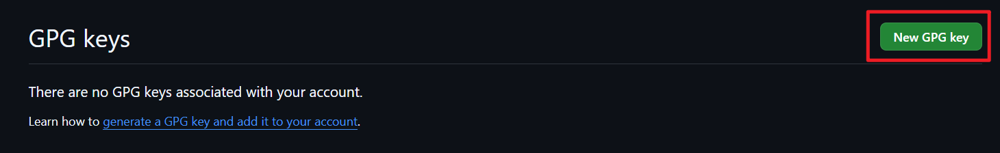

+++
date = '2025-03-02T6:00:00+08:00'
draft = false
title = '使用 GPG 签名你的 Git 提交'
categories = ['Deploy']
tags = ['Notes']
+++

# 前言

由于最近的项目要求强制 commit 要带有 GPG 签名，因此学习下如何让 commit 带有 GPG 签名并且让 GitHub 接受你的 GPG 签名。

# 生成 GPG 密钥对

使用下面的命令要求生成密钥

```bash
gpg --full-generate-key
```

此时会显示

```
gpg (GnuPG) 2.4.7; Copyright (C) 2024 g10 Code GmbH
This is free software: you are free to change and redistribute it.
There is NO WARRANTY, to the extent permitted by law.

Please select what kind of key you want:
   (1) RSA and RSA
   (2) DSA and Elgamal
   (3) DSA (sign only)
   (4) RSA (sign only)
   (9) ECC (sign and encrypt) *default*
  (10) ECC (sign only)
  (14) Existing key from card
Your selection?
```

GitHub 目前支持以下的加密方法

* RSA
* ElGamal
* DSA
* ECDH
* ECDSA
* EdDSA

按照要求和实际情况选择你想使用的加密算法。

然后要求你输入密钥生成的长度

```
RSA keys may be between 1024 and 4096 bits long.
What keysize do you want? (3072)
```

输入的长度一般在 1024 至 4096 之间

随后要求设置密钥的过期时间

```
Please specify how long the key should be valid.
         0 = key does not expire
      <n>  = key expires in n days
      <n>w = key expires in n weeks
      <n>m = key expires in n months
      <n>y = key expires in n years
Key is valid for? (0)
```

选择 0 永不过期或者几天内过期或者几年内才过期，根据自己的需求自行抉择。

随后根据提示依次设置自己的名称、邮箱以及密钥注释

```
GnuPG needs to construct a user ID to identify your key.

Real name: 
Email address: 
Comment: GitHub
You selected this USER-ID:
    ""

Change (N)ame, (C)omment, (E)mail or (O)kay/(Q)uit? 
```

之后会要求你用密码保护你的密钥，设置一个你能记住的安全的密码

然后等它一下就创建好了一个 GPG 密钥

随后可以使用 `gpg --list-secret-keys --keyid-format=long` 查看所有的密钥

```
gpg --list-secret-keys --keyid-format=long
```

展示格式的大概意思是

```
sec   加密算法 长度/短ID 2025-03-01 [作用] [expires: 过期时间]
      长ID
uid                 [ultimate] 名称 (备注) <邮箱>
```

其中作用中的字母表示

| 字母 | 含义                    |
| ---- | ----------------------- |
| C    | 能够给其它密钥/证书签名 |
| S    | 能够给文件签名          |
| A    | 身份鉴权                |
| E    | 加密数据                |

**如果**你对某个密钥不满意，可以使用

```
gpg --delete-secret-keys 长ID
gpg --delete-key 长ID
```

先删除私钥，这会需要你仔细阅读并确认才能完成删除，然后删除公钥

# 导出公钥

使用下面的命令导出所需密钥的公钥

```
gpg --armor --export 长ID
```

然后你就得到了一串以 `-----BEGIN PGP PUBLIC KEY BLOCK-----` 开头以 `-----END PGP PUBLIC KEY BLOCK-----` 结尾的公钥。不要遗漏前后的标志，全部复制。

# 让 GitHub 认识我们的公钥

转到 [GitHub 设置中](https://github.com/settings/keys)。点击“New GPG Key”，名字看自己心情，内容粘贴刚才复制的公钥。



然后“Add Key”并通过账户的验证

你可以勾选上“Vigilant mode”来表明哪些是自己的 commits，但这会影响到之前未签名的 commits。


到此，GitHub 已经认识了我们的公钥，之后签名的 commits 都会标记为 `Verified`。

# 让 Git 对 commits 签名

使用下面的命令告诉 Git 用我的哪个 GPG 密钥进行签名

```
git config --global user.signingkey 长ID
```

然后可以对一个 commit 加上 `-s` 执行签名操作

很显然每次加上 `-s` 实在是太麻烦了，所以给 Git 设置要求每次 commit 都执行签名操作

```bash
git config --global commit.gpgsign true
```

此外你还需要告诉 Git 你的签名程序是哪个，不然过几天就发现出现 `gpg: skipped "***": No secret key` 错误

```
git config --global gpg.program "C:\Program Files (x86)\gnupg\bin\gpg.exe"
```

> 记得改为你自己的 GPG 程序地址

# 参考文章

* [在Github上使用GPG的全过程 - 知乎](https://zhuanlan.zhihu.com/p/76861431)
* [生成新 GPG 密钥 - GitHub 文档](https://docs.github.com/zh/authentication/managing-commit-signature-verification/generating-a-new-gpg-key)
* [将 GPG 密钥添加到 GitHub 帐户 - GitHub 文档](https://docs.github.com/zh/authentication/managing-commit-signature-verification/adding-a-gpg-key-to-your-github-account)