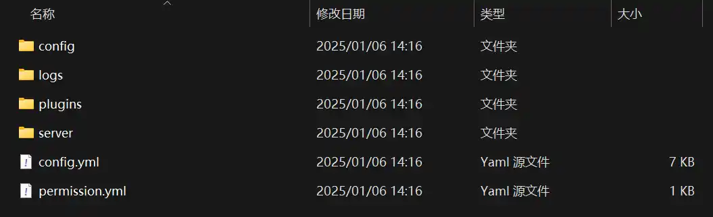
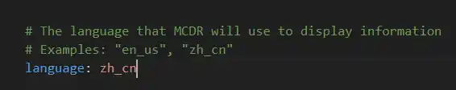
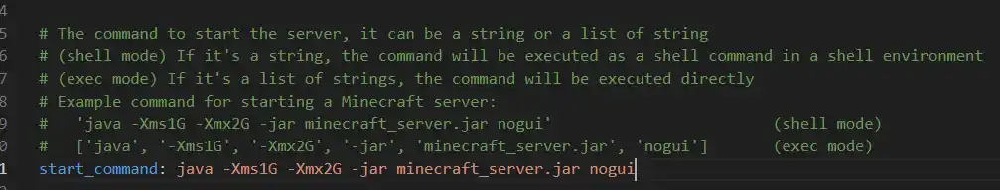
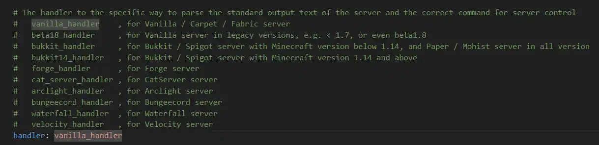
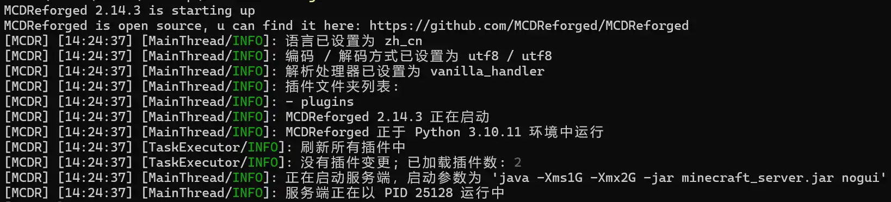

+++
date = '2025-01-08T18:00:00+08:00'
draft = false
title = '使用 MCDReforged 管理你的 Minecraft 服务器'
categories = ['Resource', 'Deploy']
tags = ['Minecraft']
+++

## 介绍

MCDReforged 是 MCDaemon 的重置版本。MCDaemon 是 TIS 团队开发的 Minecraft 服务器管理工具，现在仓库为 Archived 状态。MCDReforged 使用 Python 开发，开发上手难度不大，插件社区也在逐步成长。

[项目网站](https://mcdreforged.com/zh-CN)
[项目仓库](https://github.com/MCDReforged/MCDReforged)
[官方文档](https://docs.mcdreforged.com/zh-cn)

## 安装

首先你要安装好了 Python 环境（Python 版本>=3.9，没安装 Python 环境的同学直接安装最新版本 Python 就行），随后只需要下面这一行命令

```bash
pip install mcdreforged
```
> Linux 需要配置虚拟环境

如果你发现下载速度巨慢，则需要进行换源。先 Ctrl+C 取消当前的 Python 包安装，然后复制执行下面的命令

```bash
python -m pip install --upgrade pip
pip config set global.index-url https://mirrors.tuna.tsinghua.edu.cn/pypi/web/simple
```
运行结束后重新执行安装 MCDReforged 的命令

当然 MCDReforged 支持 Docker 部署，详情请至官方文档。

## 使用

准备一个空文件夹并在文件夹内执行下面这个命令

```bash
mcdreforged init
```

然后就会生成一堆文件和文件夹



把准备好的服务端或者已有的服务端文件丢入 server 文件夹里，随后编辑 config.yml 文件



修改语言字段 `language` 为 `zh_cn`

修改启动命令字段 `start_command` 为你的服务端对应的启动命令



按照注释中的提示修改处理方式字段 `handler`

比如 Fabric 端为 `vanilla_handler，Forge` 端则为 `forge_handler`



这样一改下来，差不多就是能跑的样子了。使用下面的命令开启服务器而不是原来的开服命令。

```bash
mcdreforged
```



## 安装插件

~~不使用插件的话安装 MCDR 干什么~~
这里放几个常用的插件，都可以直接使用命令安装
[插件仓库](https://mcdreforged.com/zh-CN/plugins)

### Bot

管理服务器假人，使用地毯模组
```bash
!!MCDR plugin install bot
```
### Prime Backup

存档备份插件，增量备份，只归档变化的内容
```bash
!!MCDR plugin install prime_backup
```
### Mirror Sync Reforged

同步存档到镜像服务器
```bash
!!MCDR plugin install mirror_sync_reforged
```
### HibernateR

长时间没玩家自动关闭服务器以释放资源，有人想进来时自动开启服务器。~~不过 Minecraft 启动比待机更耗电就是了~~
```bash
!!MCDR plugin install hibernate_r
```
### Beep

@ 一个人，并有音效提醒。~~还能多加几个 @ 吵死别人~~
```bash
!!MCDR plugin install beep
```

当然还有很多插件可以去体验，不止限于上面几个。