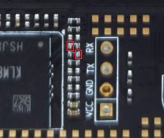
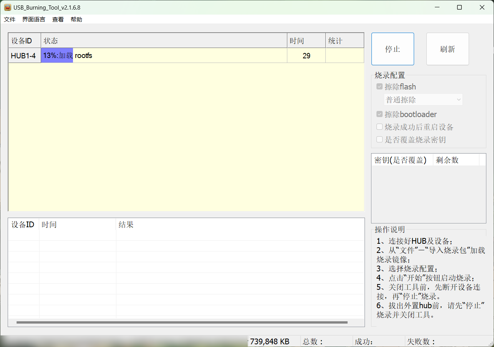
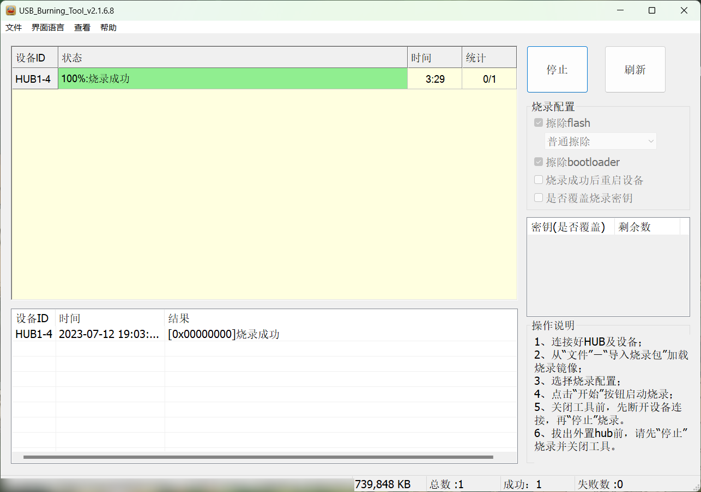
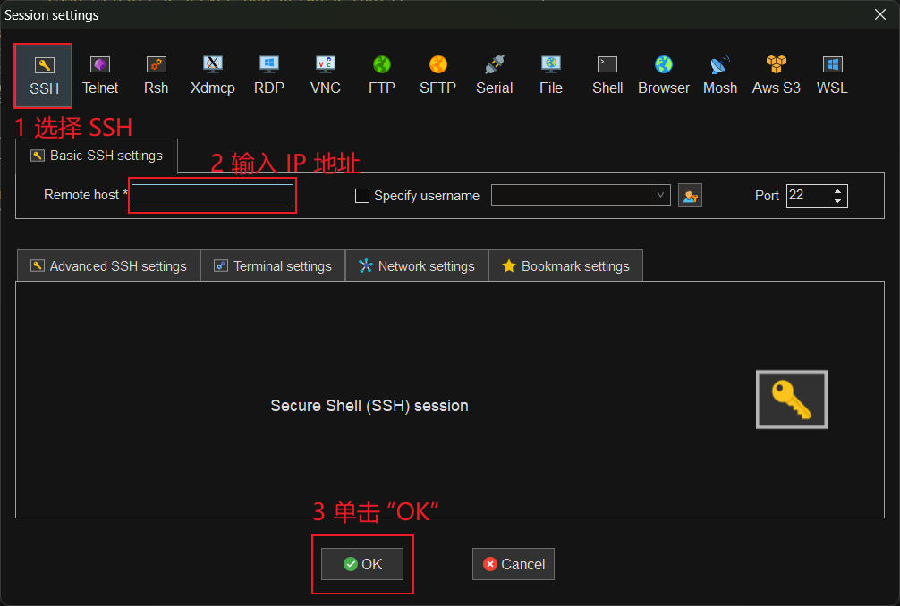
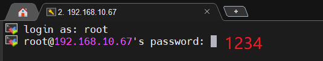
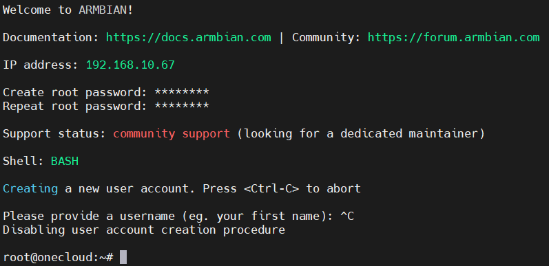

+++
date = '2024-06-20T18:00:00+08:00'
draft = false
title = '网心云设备刷机教程'
+++

## 前提说明

本文章仅面向于简单的刷机教程，不会过多的涉及到其中一些具体的技术，因此在阅读过程中遇到的任何问题请通过搜索解决。

网心云是由网心科技打造的闲置带宽、存储和算力的共享边缘计算C端采集平台，说直白就是在你家部署边缘计算，不过这类边缘计算是网络指向型的，对网络的需求比较高。设备的功耗比较低，适合用来作为家庭低端 NAS。

---

## 刷机步骤

### 硬件器材准备

| 器材名称 | 备注 | 数量 |
| --- | --- | --- |
| 玩客云 | 建议买二手货，全新的比较贵反正最终都要刷掉原系统 | 1 |
| 电源适配器 | 12V 1.5A | 1 |
| 公对公 USB 线 | USB-A 2.0/USB-A 3.0 | 1 |
| 电吹风/热风枪 | 加热背板的东西，如果你有其它安全的方式，那也行 | 1 |
| 十字形螺丝刀 | | 1 |
| 拆机片/一字形螺丝刀 | 用于扒开背板的工具，如果你有其它方式，那也行 | 1 |
| 尖嘴老虎钳 | 非必须，主要机器的主板比较难取下，直接上手易受伤 | 1 |
| 计算机 | Windows 操作系统 | 1 |

### 软件工具准备

| 名称 | 备注 | 下载地址 |
| --- | --- | --- |
| Armbian | Debian 的一个分支<br>请下载 /*_minimal.burn.img 版本的文件，如果你不知道下载哪个，那就[直接点击这个下载](https://mirror.ghproxy.com/?q=https%3A%2F%2Fgithub.com%2Fhzyitc%2Farmbian-onecloud%2Freleases%2Fdownload%2Fci-20240311-162146-UTC%2FArmbian-unofficial_24.5.0-trunk_Onecloud_bookworm_current_6.6.21_minimal.burn.img.xz) | [Github](https://github.com/hzyitc/armbian-onecloud/releases) |
| MobaXterm | 万能连接工具 | [官网地址](https://mobaxterm.mobatek.net/download-home-edition.html) |
| 晶晨线刷工具 | 建议安装 2.1.6.8 版本，高版本在刷机的最后步骤会莫名其妙的报错 | [蓝奏云盘](https://tangge233.lanzoum.com/iW5LI115dfhi) |

## 具体操作

先用电吹风加热后板，用拆机片或者其它工具拆下外板，然后拧下 6 颗螺丝，拆下后板。这时你就可以看到主板的真容了。用尖嘴老虎钳拔出主板（别伤到触点），放于一旁备用。再取用公对公 USB 线，连接计算机与主板（远离网口的 USB 口）。再准备电源线（先不要供电），连接主板。



启动刷机软件（晶晨线刷工具），载入你在上面下载的镜像，并点击“开始”，软件会等待设备的启动连接。在给设备接入电源之前，请使用镊子短接主板上的两个触点。下面是 V1.3 版本主板触点所在位置，触点很小请不要短接错了。

在短接的状态下接通电源，此时不出意外的话软件已经识别到主板并开始刷入系统，此时请松开短接，等待刷入成功。如果出现报错，请不要慌张，多尝试几次即可。





刷机成功后先单击“停止”，后断开主板电源，拔下公对公 USB 线，连接上网线。

---

## 初始化软件

再次接上电源，设备可能会出现红灯中闪烁者白灯的情况，这不会影响使用。打开你的路由器后台（IP 地址一般是 `192.168.1.1` 也有可能是 `192.168.10.1` 具体是怎样请查阅自己的路由器说明书），进入后台后找到名称为 `onecloud` 的设备，并将其 IP 地址复制下来。



打开 `MobaXterm` ，单击上方图标中的 Session，选择 SSH ，并输入 IP 地址连接。

默认的用户名是 `root`，密码是 `1234`。




首次登录要求重新设置 root 账户的密码，输入一个你可以记住的密码。除非你的设备只在内网使用，否则请设置一个较为复杂的密码。设置完成密码后用 Ctrl+C 取消新用户创建。

>如果您的设备是暴露在公网的，那么您需要更加安全的设置方式

下面您需要输入一系列代码，您需要对下方文本进行修改后再执行

```bash
timedatectl set-timezone Asia/Shanghai
#设置时区为东八区
hostnamectl set-hostname 主机名称（仅英文、数字）
#设置主机名称
```

至此您已完成网心云主机的刷机