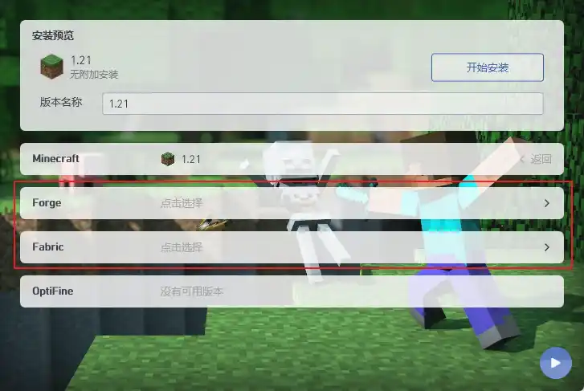
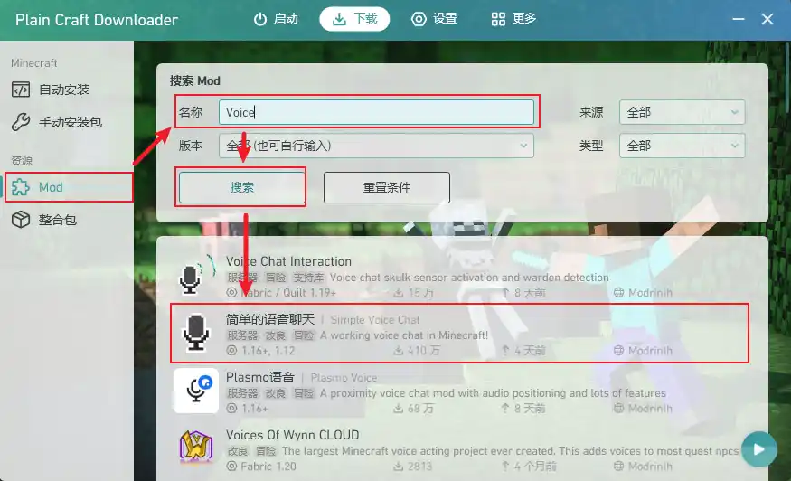
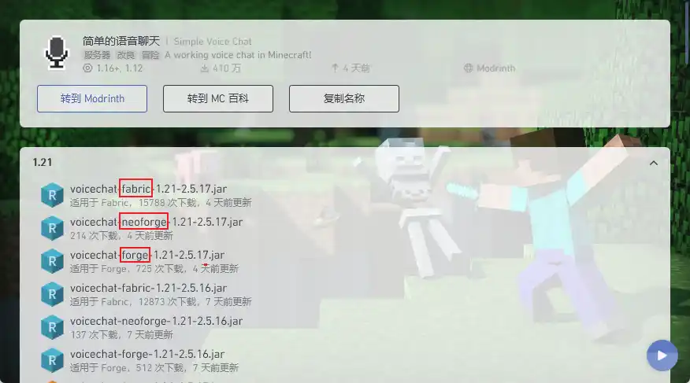
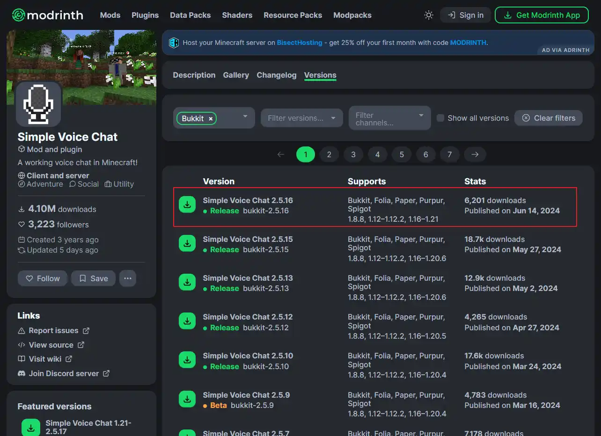
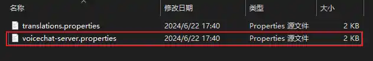
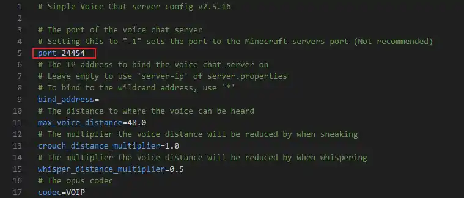
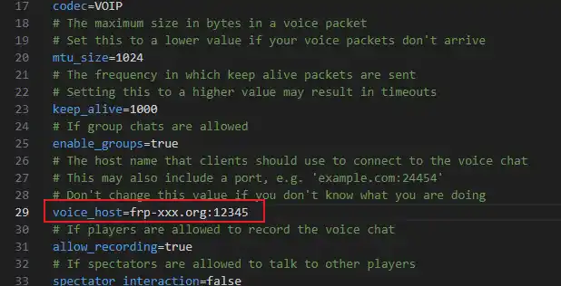

+++
date = '2024-06-22T18:00:00+08:00'
draft = false
title = '为 Minecraft 服务器设置 Simple Voice Chat'
categories = ['Deploy']
tags = ['Minecraft']
+++

## 什么是 Simple Voice Chat

Simple Voice Chat 是一个允许玩家直接在游戏内进行语音通话的 Mod，有了它您不再需要借助外部的软件即可与游戏内的玩家进行语音沟通。您需要注意的是您的语音通话内容可能会被对方通过 `Reply Voice Chat` 记录下来。

在使用前需要注意，SVC 不支持 IPv6 网络，使用 IPv6 进行联机可能会出现 SVC 不可用情况。

[MC 百科页面](https://www.mcmod.cn/class/3693.html)
[Modrinth](https://modrinth.com/plugin/simple-voice-chat)
[官方文档](https://modrepo.de/minecraft/voicechat/overview)
[视频教程](https://www.bilibili.com/video/BV1mS421d78d)

## 部署

### 客户端

`Simple Voice Chat` 需要 Forge 或者 Fabric 模组加载器，以 PCL 为例子展示模组安装使用。

(如已安装加载器可跳过)在 PCL 中安装 Forge 或者 Fabric 加载器，只需要选择版本后选择其中一个加载器类型即可。

模组下载可以通过 PCL 的模组下载功能或者直接前往 Modrinth 托管的项目中直接下载获取

#### PCL 下载模组

在 PCL 中搜索关键词 `Voice`

找到对应版本以及加载器，下载模组。通过文件名可以判别模组所需要的加载器，比如 `fabric` `neoforge` `forge` 等关键词。

#### Modrinth 上直接下载

服务端支持插件或者模组，前往 Modrinth 官网可以获取到插件或者模组版本。
~~当然，你可以使用 `Arclight` 这样同时支持模组和插件的服务端，但这样多此一举了~~

这里下载的是服务端是插件端时下载的文件

### 服务端加载

对于模组服，直接将 SVC 丢入 mods 文件夹中；对于插件服务器，丢入 plugins 文件夹即可。重启服务器以加载模组/插件，修改配置文件后也需要重启才能应用。
使用时，请确保 24454 端口 UDP 协议放行（部分使用者反馈 IPv6 情况下可能会出现无法连接的情况，暂时不清楚近期版本是否修复）。

### 对于使用内网穿透用户

内网穿透端口是随机的，客户端不一定能正确连接到服务端。SVC 配置文件提供了一个 `voice_host` 配置项，用于指定服务端的 IP 地址和端口，从而解决内网穿透端口问题。

插件服可以在 `plugins\voicechat` 中找到 `voicechat-server.properties` 配置文件。模组服需要在 `config\voicechat` 里找到。

打开配置文件可以看到目前 SVC 的通信监听端口是 24454

我们打开内网穿透服务后台，添加一个对 24454 端口的映射，协议为 UDP。

启动隧道之后我们可以得到对外地址，我们将对外地址填入 `voice_host` 配置项中。

之后重启服务器，客户端连接的时候就会尝试使用此地址进行语音通话通讯了。